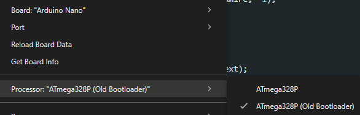

# Pong
Un progetto scolastico che usa delle schede Arduino *(ed in futuro ESP8266/ESP32)* per giocare al famoso gioco Pong.

## Caratteristiche
- Uso di un potenziometro come joystick
- Uso di un display OLED 0.96" I2C come schermo
- Singleplayer
- Partite contro una racchetta ferma (con collisioni)
- Configurazione completa in [definitions.h](definitions.h)

## Uso
Per caricare il codice è necessario avere un Arduino Nano, e su Arduino IDE impostare il vecchio bootloader (`Old Bootloader`) quando si deve scegliere il tipo di processore della scheda.

Ora si può fare l'upload del source code.

### Uso del codice precompilato

È anche possibile usare l'ultimo binario disponibile, che è semplicemente il codice sorgente compilato con i parametri corretti. File binario: [pong.ino.hex](build/arduino.avr.nano/pong.ino.hex).

## Altro
Versione: `v0.1-beta`

*Questo è un progetto scolastico e potrebbe smettere di ricevere aggiornamenti in qualsiasi momento.*