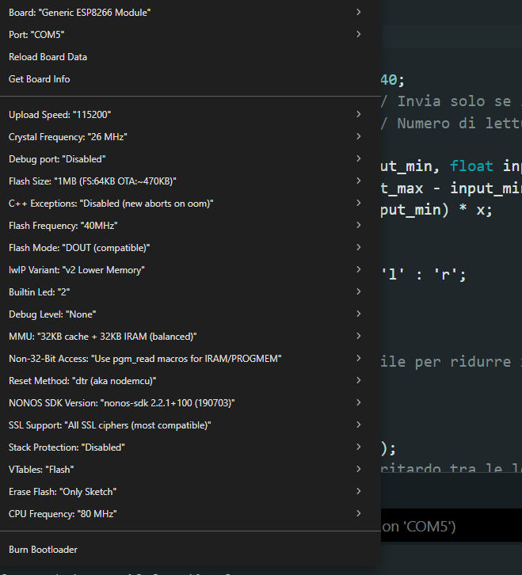
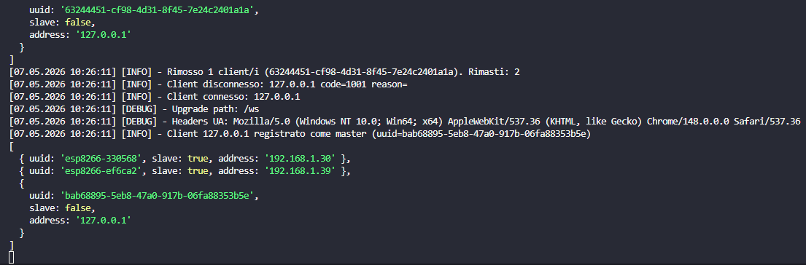
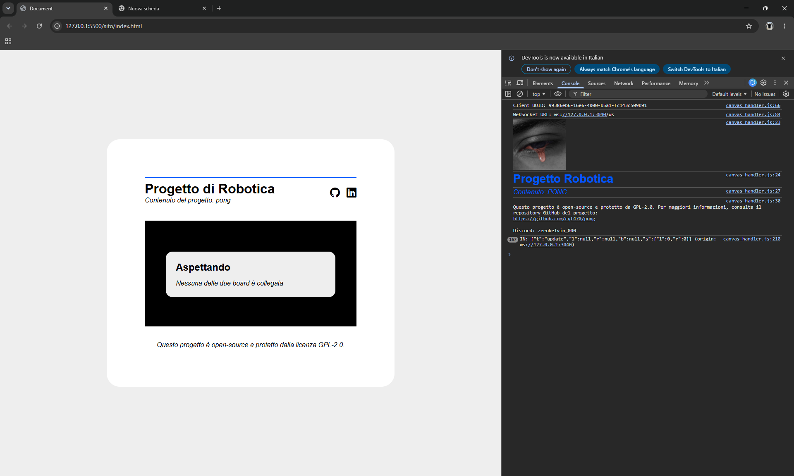

# Pong
Un progetto scolastico che usa delle schede ESP8266 per giocare al famoso gioco Pong, con un potenziometro come "joystick".

## Caratteristiche
- Uso di un potenziometro come joystick
- Uso di una pagina web come display
- Multiplayer
- Frontend: `HTML` + `JS` puri *(Codice custom)*
- Backend: `Node.js`: `Express`, `WebSocket` e altro

## Uso

### Requisiti

La libreria da installare in più per il funzionamento del codice C++ è solo una, ovvero `WebSockets by Markus Sattler` (https://github.com/Links2004/arduinoWebSockets).

### Caricamento del codice

#### Usando il source code
Per caricare il codice è necessario avere due schede ESP8266 ed il software Arduino IDE, come anche la libreria per le schede ESP8266 installata ([vedi repo GitHub](https://github.com/esp8266/arduino)).

Una volta installato tutto, bisogna aprire il file [slave.ino](clients/slave/slave.ino) con Arduino IDE, cambiando le variabili `ssid` e `password` in `slave_esp8266.h` per corrispondere ad una rete in cui possiamo connetterci al server WebSocket.

> Origine: [slave_esp8266.h](clients/slave/slave_esp8266.h) 
```C++
const char* ssid = "FibreBox_X6-347BB7_10";
const char* password = "T9JY4U6CNMC6FMXNW7";
```

Cambiare anche `IS_LEFT_PLR` a true o false, a dipendenza della posizione del giocatore (e quindi della racchetta/paddle).

> Origine: [slave.ino](clients/slave/slave.ino) 
```C++
#define IS_LEFT_PLR <bool: true|false>
```

Poi, bisogna collegare una delle due schede al PC, scegliere la porta COM corrispondente e il baud rate di upload a scelta, assieme a tutte le altre impostazioni presenti.



Ora si può fare l'upload del source code.

#### Usando il codice precompilato

È anche possibile usare l'ultimo binario disponibile, che è semplicemente il codice sorgente compilato con i parametri corretti. File binari: 
- Per il giocatore a sinistra, [slave_LEFT.ino.bin](build/esp8266.esp8266.generic/slave_LEFT.ino.bin)
- Per il giocatore a destra, [slave_RIGHT.ino.bin](build/esp8266.esp8266.generic/slave_RIGHT.ino.bin)

### Schematica

Questa seziona deve ancora essere realizzata.

## Avvio del server

Assicurati di avere [Node.js](https://nodejs.org/) installato. Poi, naviga verso la [cartella del server websocket](sito/ws/) ed esegui:
```bash
npm install dotenv express nodemon pm2 ws # Installa le dipendenze
```
```bash
# SCEGLI SOLO UNO DEI SEGUENTI
npm run dev         # Riavvia il server se applichi modifiche ai file
node index.js       # Esegue lo script
pm2 start index.js  # Gestione da server (SCONSIGLIATO PER TEST)
```
<small>pm2 è un pacchetto potente e che viene spesso usato sui server. Permette di riavviare lo script se crasha, allocare certe risorse, eseguirlo con un interpreter specifico e molto altro. Non lo consiglio per test, essendo che non riesco a farlo funzionare sulla mia macchina Windows, ed in generale è troppo potente. Referenza: https://github.com/Unitech/pm2</small>

## Esempio di file .env
In questo progetto il file .env è stato rimosso dal tracking, ma la sua struttura è simile a:

```SH
ENV=<DEV|PROD>
PORT=<es: 3040>

URL_HTTP_PROD=https://example.com
URL_HTTP_DEV=http://localhost
URL_WS_PROD=ws://example.com/ws
URL_WS_DEV=ws://localhost
```

## Preview

> La console su cui gira il server


> L'interfaccia web


## DISCLAIMER
Notare che il progetto è ancora in `FASE DI SVILUPPO`. Pertanto, non esiste un webserver su cui il codice possa funzionare, se non in locale. Questo è dovuto al fatto che i vari client ([index.html](sito/index.html) e [slave.ino](clients/slave/slave.ino)) supportano solo connessioni HTTP, mentre il WebServer sarà hostato su un homelab, accessibile da internet tramite tunnel CloudFlare, quindi via HTTPS *(Rispettivamente wss:// e non ws://)*.

## Licenza

Questo progetto è distribuito sotto la licenza GPL-2.0. Per maggiori informazioni, contattarmi via email a `questions@zexa.ch` oppure su Discord all'username `zerokelvin-000`.

## Altro
Versione: `v0.2-beta`

*Questo è un progetto scolastico e potrebbe smettere di ricevere aggiornamenti in qualsiasi momento.*